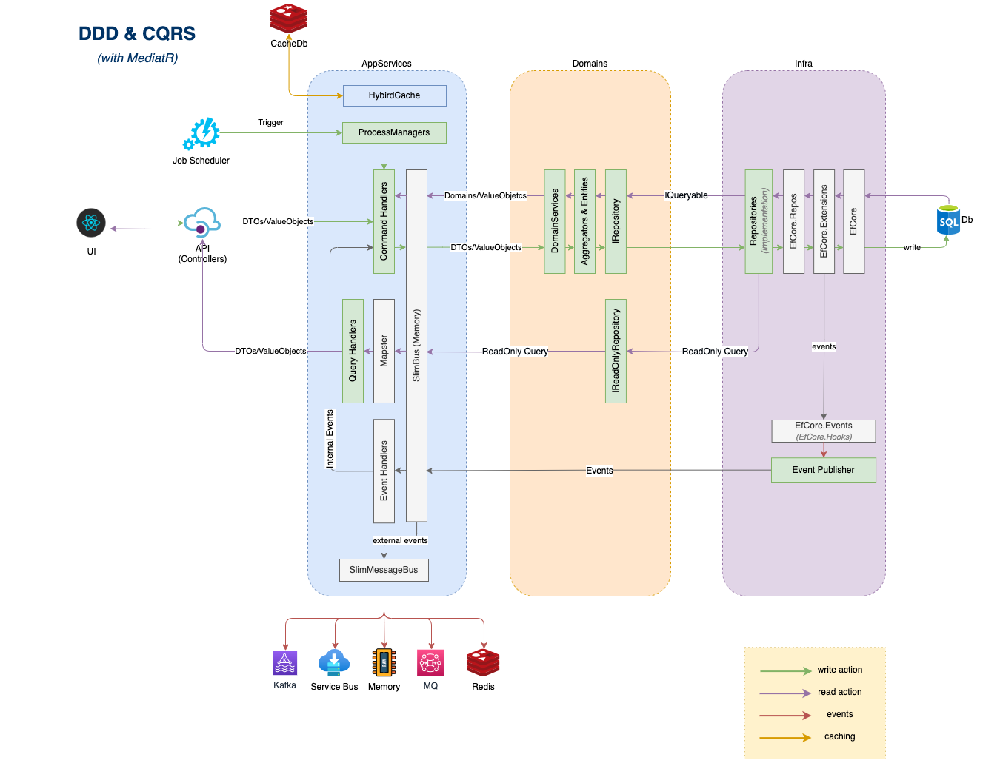

# DKNet Framework

[](https://codecov.io/github/baoduy/DKNet)
[](https://dotnet.microsoft.com/)
[](LICENSE)
[](https://www.nuget.org/packages/DKNet.Fw.Extensions/)
[](https://github.com/baoduy/DKNet/actions/workflows/codeql.yml)
[](https://sonarcloud.io/summary/new_code?id=baoduy_DKNet)


## Overview

**DKNet Framework** is a comprehensive collection of .NET libraries designed to enhance and simplify enterprise application development using **SlimMessageBus as a MediatR alternative** with **Domain-Driven Design (DDD)** principles. The framework provides robust foundations for building secure, scalable, and maintainable APIs while promoting clean architecture patterns and separation of concerns.

All projects in this framework serve as reference implementations and template foundations to help developers understand how to design their APIs securely and implement modern architectural patterns effectively.

---

## 🚀 Key Features

- **SlimMessageBus Integration**: Lightweight alternative to MediatR for CQRS and messaging patterns
- **Domain-Driven Design**: Full DDD implementation with aggregates, entities, and domain events
- **Clean Architecture**: Layered architecture with strict separation of concerns
- **EF Core Extensions**: Comprehensive Entity Framework Core enhancements and patterns
- **Security-First**: Built-in security patterns and data authorization mechanisms
- **Template Projects**: Ready-to-use project templates for rapid development
- **Aspire Integration**: .NET Aspire hosting extensions for cloud-native applications
- **Architectural Governance**: Automated enforcement of architectural rules using ArchUnitNET

---

## 📁 Project Structure

### 📋 Complete Project Overview

| Project | Category | Description | Code | Documentation |
|---------|----------|-------------|------|---------------|
| **DKNet.Fw.Extensions** | Core Framework | Framework-level extensions and utilities | [📁 Code](Core/DKNet.Fw.Extensions) | [📖 Docs](docs/Core/DKNet.Fw.Extensions.md) |
| **DKNet.EfCore.Abstractions** | EF Core Extensions | Core abstractions and interfaces | [📁 Code](EfCore/DKNet.EfCore.Abstractions) | [📖 Docs](docs/EfCore/DKNet.EfCore.Abstractions.md) |
| **DKNet.EfCore.DataAuthorization** | EF Core Extensions | Data authorization and access control | [📁 Code](EfCore/DKNet.EfCore.DataAuthorization) | [📖 Docs](EfCore/DKNet.EfCore.DataAuthorization/README.md) |
| **DKNet.EfCore.Events** | EF Core Extensions | Domain event handling and dispatching | [📁 Code](EfCore/DKNet.EfCore.Events) | [📖 Docs](EfCore/DKNet.EfCore.Events/README.md) |
| **DKNet.EfCore.Extensions** | EF Core Extensions | EF Core functionality enhancements | [📁 Code](EfCore/DKNet.EfCore.Extensions) | [📖 Docs](EfCore/DKNet.EfCore.Extensions/README.md) |
| **DKNet.EfCore.Hooks** | EF Core Extensions | Lifecycle hooks for EF Core operations | [📁 Code](EfCore/DKNet.EfCore.Hooks) | [📖 Docs](EfCore/DKNet.EfCore.Hooks/README.md) |
| **DKNet.EfCore.Relational.Helpers** | EF Core Extensions | Relational database utilities | [📁 Code](EfCore/DKNet.EfCore.Relational.Helpers) | [📖 Docs](EfCore/DKNet.EfCore.Relational.Helpers/README.md) |
| **DKNet.EfCore.Repos** | EF Core Extensions | Repository pattern implementations | [📁 Code](EfCore/DKNet.EfCore.Repos) | [📖 Docs](EfCore/DKNet.EfCore.Repos/README.md) |
| **DKNet.EfCore.Repos.Abstractions** | EF Core Extensions | Repository abstractions | [📁 Code](EfCore/DKNet.EfCore.Repos.Abstractions) | [📖 Docs](docs/EfCore/DKNet.EfCore.Repos.Abstractions.md) |
| **DKNet.SlimBus.Extensions** | Messaging & CQRS | SlimMessageBus extensions for EF Core | [📁 Code](SlimBus/DKNet.SlimBus.Extensions) | [📖 Docs](docs/Messaging/DKNet.SlimBus.Extensions.md) |
| **DKNet.Svc.BlobStorage.Abstractions** | Service Layer | File storage service abstractions | [📁 Code](Services/DKNet.Svc.BlobStorage.Abstractions) | [📖 Docs](docs/Services/DKNet.Svc.BlobStorage.Abstractions.md) |
| **DKNet.Svc.BlobStorage.AwsS3** | Service Layer | AWS S3 storage adapter | [📁 Code](Services/DKNet.Svc.BlobStorage.AwsS3) | [📖 Docs](Services/DKNet.Svc.BlobStorage.AwsS3/README.md) |
| **DKNet.Svc.BlobStorage.AzureStorage** | Service Layer | Azure Blob storage adapter | [📁 Code](Services/DKNet.Svc.BlobStorage.AzureStorage) | [📖 Docs](Services/DKNet.Svc.BlobStorage.AzureStorage/README.md) |
| **DKNet.Svc.BlobStorage.Local** | Service Layer | Local file system storage | [📁 Code](Services/DKNet.Svc.BlobStorage.Local) | [📖 Docs](Services/DKNet.Svc.BlobStorage.Local/README.md) |
| **DKNet.Svc.Transformation** | Service Layer | Data transformation services | [📁 Code](Services/DKNet.Svc.Transformation) | [📖 Docs](Services/DKNet.Svc.Transformation/README.md) |
| **Aspire.Hosting.ServiceBus** | Cloud-Native & Hosting | .NET Aspire Service Bus hosting extensions | [📁 Code](Aspire/Aspire.Hosting.ServiceBus) | [📖 Docs](Aspire/Aspire.Hosting.ServiceBus/README.md) |

### 🚀 Templates & Examples

| Template | Description | Code | Documentation |
|----------|-------------|------|---------------|
| **SlimBus.ApiEndpoints** | Complete API template using SlimMessageBus | [📁 Code](templates/SlimBus.ApiEndpoints) | [📖 Docs](templates/SlimBus.ApiEndpoints/README.md) |

---

## 🏗️ Architecture Overview

### Domain-Driven Design Implementation

The framework implements a full DDD approach with:



```
┌─────────────────┐    ┌─────────────────┐    ┌─────────────────┐
│   API Layer     │    │  Application    │    │   Domain        │
│                 │    │   Services      │    │                 │
│ • Controllers   │◄──►│ • Commands      │◄──►│ • Entities      │
│ • Endpoints     │    │ • Queries       │    │ • Aggregates    │
│ • Validation    │    │ • Events        │    │ • Value Objects │
└─────────────────┘    └─────────────────┘    └─────────────────┘
         │                       │                       │
         ▼                       ▼                       ▼
┌─────────────────┐    ┌─────────────────┐    ┌─────────────────┐
│ Infrastructure  │    │   SlimBus       │    │   EF Core       │
│                 │    │                 │    │                 │
│ • Repositories  │    │ • Message Bus   │    │ • DbContext     │
│ • External APIs │    │ • Event Handlers│    │ • Change Tracking│
│ • File Storage  │    │ • CQRS Pipeline │    │ • Interceptors  │
└─────────────────┘    └─────────────────┘    └─────────────────┘
```

### Documentation

📖 **[Complete Framework Documentation](docs/README.md)** - Comprehensive documentation organized by functional areas

For detailed information about architecture, implementation patterns, and usage examples, visit our [complete documentation](docs/README.md) or refer to our [GitHub Pages](https://baoduy.github.io/DKNet/)

---

## 📄 License

This project is licensed under the [MIT License](LICENSE).

---

## 🙏 Acknowledgments

- **SlimMessageBus Team**: For providing an excellent messaging framework
- **Entity Framework Team**: For the robust ORM foundation
- **Domain-Driven Design Community**: For architectural guidance and patterns
- **Contributors**: All developers who have contributed to this framework
