# Getting Started with DKNet

DKNet is not a framework you adopt wholesale — it is 28 independent NuGet packages. Getting started means
picking the two or three you need and wiring them up. This page covers the prerequisites, the smallest setup
that actually runs, and where to go next.

## Prerequisites

- **.NET 10.0 SDK** — every package you reference targets `net10.0` (the two Roslyn source generators,
  `DKNet.EfCore.DtoGenerator` and `DKNet.SlimBus.Generators`, target `netstandard2.0` so the compiler can load
  them — that does not change what your app targets), and `src/global.json` pins SDK `10.0.0` with
  `rollForward: latestMajor`.
- **Visual Studio 2022** (17.13+), **Visual Studio Code**, or **JetBrains Rider**.
- A **relational database** if you use the EF Core packages. The samples below use SQL Server; the packages
  themselves are provider-agnostic apart from `DKNet.EfCore.Relational.Helpers` and the two relational
  idempotency stores.
- Working knowledge of EF Core. Familiarity with DDD helps, but no package requires it.

## Quick start

### 1. Install what you need

The [Which package do I need?](README.md#which-package-do-i-need) table maps problems to packages. A typical
DDD-style API starts with four:

```bash
# Entity base classes and the domain-event contracts
dotnet add package DKNet.EfCore.Abstractions

# Entity configuration discovery, global query filters, seeding, GUID v7 keys
dotnet add package DKNet.EfCore.Extensions

# Querying and persistence through IRepositorySpec
dotnet add package DKNet.EfCore.Specifications

# CQRS handlers with automatic SaveChanges
dotnet add package DKNet.SlimBus.Extensions
```

Add more as the need appears — nothing above depends on the others being present, and no package needs a
companion "core" package.

> `DKNet.EfCore.Repos` and `DKNet.EfCore.Repos.Abstractions` were **removed** and were never published to NuGet.
> `dotnet add package` will not find them. Use `DKNet.EfCore.Specifications` — see
> [Migrating-Repos-To-Specifications](EfCore/Migrating-Repos-To-Specifications.md) if you are upgrading off them.

### 2. Define an entity

Derive from `AuditedEntity` (Guid-keyed, with created/updated tracking and a domain-event queue) or from plain
`Entity` if you do not want the audit fields. Change state through methods, not public setters:

```csharp
using DKNet.EfCore.Abstractions.Entities;

public class Product : AuditedEntity
{
    private Product() { } // EF Core

    public static Product Create(string name, decimal price, string createdBy)
    {
        var product = new Product { Name = name, Price = price, IsActive = true };
        product.SetCreatedBy(createdBy);
        return product;
    }

    public string Name { get; private set; } = string.Empty;
    public decimal Price { get; private set; }
    public bool IsActive { get; private set; }

    public void Deactivate(string updatedBy)
    {
        IsActive = false;
        SetUpdatedBy(updatedBy);
    }
}
```

### 3. Wire it up

`AddDbContextWithHook<TDbContext>` registers the `DbContext` and the shared hook interceptor in one call;
`UseAutoConfigModel<TContext>()` is a `DbContextOptionsBuilder<TContext>` extension, so it goes here rather than
in `OnModelCreating`:

```csharp
using DKNet.EfCore.Hooks;          // AddDbContextWithHook
using DKNet.EfCore.Specifications; // AddSpecRepo
using Microsoft.EntityFrameworkCore;

var builder = WebApplication.CreateBuilder(args);

builder.Services.AddDbContextWithHook<AppDbContext>(options => options
    .UseSqlServer(builder.Configuration.GetConnectionString("Default")!)
    // Discovers every IEntityTypeConfiguration<T> in AppDbContext's assembly
    .UseAutoConfigModel<AppDbContext>());

// One IRepositorySpec serves every entity type in the context
builder.Services.AddSpecRepo<AppDbContext>();

var app = builder.Build();
app.Run();
```

`AddDbContextWithHook` is only needed when something hooks into `SaveChanges` — domain events, audit logs, or
ownership stamping. If none of those are in play, a plain `AddDbContext<AppDbContext>` works and
`UseAutoConfigModel<AppDbContext>()` still applies.

### 4. Query through a specification

A `Specification<TEntity>` is configured from its constructor and carries the filter, includes, and ordering as
one reusable object:

```csharp
using DKNet.EfCore.Specifications.Definitions;
using DKNet.EfCore.Specifications.Extensions;
using DKNet.EfCore.Specifications.Repositories;

public sealed class ActiveProductsSpec : Specification<Product>
{
    public ActiveProductsSpec()
    {
        WithFilter(p => p.IsActive);
        AddOrderBy(p => p.Name);
    }
}

public sealed class Catalogue(IRepositorySpec repo)
{
    public Task<IList<Product>> ActiveAsync(CancellationToken cancellationToken = default) =>
        repo.ToListAsync(new ActiveProductsSpec(), cancellationToken);
}
```

## How the packages fit together

Every ring of the onion is a separate package and every dependency points inward. The
[Architecture Guide](Architecture.md) has the full picture, including the package dependency graph and two
end-to-end walkthroughs (an HTTP request and a domain event):



## Next steps

1. **[Which package do I need?](README.md#which-package-do-i-need)** — pick the rest by problem.
2. **[Architecture Guide](Architecture.md)** — what a package may depend on, and how a request and an event
   travel through the suite.
3. **[Configuration & Setup](Configuration.md)** — the four registration conventions the packages share, and
   which page owns each package's own option table.
4. **[Examples & Recipes](Examples/README.md)** — a CRUD slice, domain events, specifications, multi-tenancy,
   blob storage.
5. **[SlimBus.ApiEndpoints template](https://github.com/baoduy/DKNet.Templates)** — a complete reference
   implementation in the DKNet.Templates repository.

## Common starting points

| Goal | Read next |
|---|---|
| A CRUD API with commands and queries separated | [DKNet.SlimBus.Extensions](Messaging/DKNet.SlimBus.Extensions.md), then [Examples](Examples/README.md#complete-crud-api-with-cqrs) |
| Side effects that run after a write commits | [DKNet.EfCore.Events](EfCore/DKNet.EfCore.Events.md), then [A domain event end to end](Architecture.md#a-domain-event-end-to-end) |
| Row-level isolation between tenants or owners | [DKNet.EfCore.DataAuthorization](EfCore/DKNet.EfCore.DataAuthorization.md), then [Examples](Examples/README.md#multi-tenant-application) |
| A `POST` a client can safely retry | [DKNet.AspCore.Idempotency](AspNetCore/DKNet.AspCore.Idempotency.md) plus one store package |
| Files in Azure, S3, or on disk behind one interface | [DKNet.Svc.BlobStorage.Abstractions](Services/DKNet.Svc.BlobStorage.Abstractions.md) |

## Getting help

- **Documentation**: [Documentation hub](README.md)
- **Issues**: [GitHub Issues](https://github.com/baoduy/DKNet/issues)
- **Discussions**: [GitHub Discussions](https://github.com/baoduy/DKNet/discussions)
- **Contributing**: [Contributing Guide](Contributing.md)
